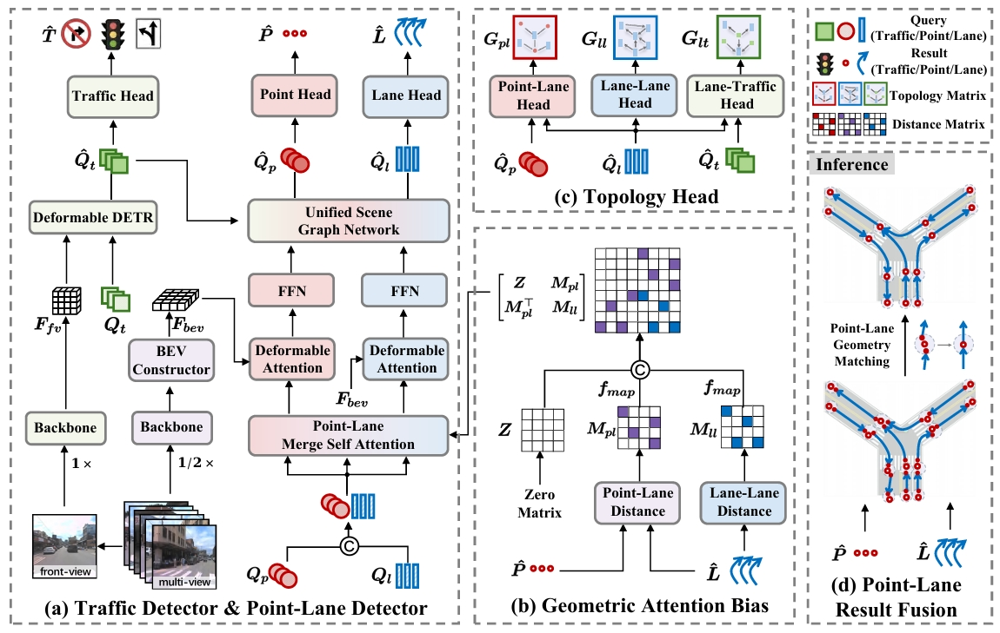

<div align="center">

# TopoPoint: Enhance Topology Reasoning via Endpoint Detection in Autonomous Driving


[](https://arxiv.org/pdf/2505.17771)
[](https://github.com/Franpin/TopoPoint)




</div>

> - Production from [Institute of Computing Technology, Chinese Academy of Sciences](http://www.ict.ac.cn/). 
> - Primary contact: **Yanping Fu** ( fuyanping23s@ict.ac.cn ).


TL;DR
---
This repository contains the source code of **TopoPoint**, [Enhance Topology Reasoning
 via Endpoint Detection in Autonomous Driving](https://arxiv.org/pdf/2505.17771).

TopoPoint identify the endpoint deviation issue in existing topology reasoning methods. To tackle this, TopoPoint introduces explicit endpoint detection and strengthens
 point-lane interaction through **Point-Lane Merge Self-Attention** and  **Point-Lane Graph Convolutional Network**, and further design **Point-Lane Geometry Matching** algorithm to refine lane endpoints.


Updates
--- 
- [2025.5.23] TopoPoint paper is released at [arXiv](https://arxiv.org/abs/2405.14747)
## Table of Contents
- [TopoPoint: An Interpretable Pipeline for Lane Topology Reasoning on Driving Scenes](#TopoPoint-an-interpretable-pipeline-for-lane-topology-reasoning-on-driving-scenes)
  - [Table of Contents](#table-of-contents)
  - [Main Results](#main-results)
    - [Results on OpenLane-V2 subset-A val](#results-on-openlane-v2-subset-a-val)
  - [Prerequisites](#prerequisites)
  - [Installation](#installation)
  - [Prepare Dataset](#prepare-dataset)
  - [Train and Evaluate](#train-and-evaluate)
    - [Train](#train)
    - [Evaluate](#evaluate)
  - [Citation](#citation)
  - [Related resources](#related-resources)

## Main Results
> The result is based on the updated `v2.1.0` OpenLane-V2 devkit and metrics.
### Results on OpenLane-V2 subset-A val

We provide results on **[Openlane-V2](https://github.com/OpenDriveLab/OpenLane-V2) subset-A val** set.

|    Method    | Backbone | Epoch | DET<sub>l</sub> | DET<sub>t</sub> | TOP<sub>ll</sub> | TOP<sub>lt</sub> |   OLS    | DET<sub>p</sub>      |
| :----------: |----| :---: | :-------------: | :--------------: | :-------------: | :--------------: | :------: | :------: |
|     STSU     | ResNet-50 |  24   |     12.7       |      43.0       |       2.9        |       19.8       |   29.3   | - |
| VectorMapNet | ResNet-50 |  24    |    11.1       |      41.7       |       2.7        |       9.2        |   24.9   | - |
|    MapTR     | ResNet-50 |  24    |     17.7        |      43.5       |       5.9        |       15.1        |   31.0   | - |
| TopoNet  | ResNet-50 |  24   |   28.6     |    48.6     |     10.9      |    23.8     | 39.8 | 43.8 |
| TopoMLP  | ResNet-50 |  24   |   28.3     |    49.5     |     21.6      |    26.9     | 44.1 | 43.4 |
| TopoLogic | ResNet-50 | 24  | 29.9 |47.2 | 23.9  | 25.4  | 44.1 | 45.2 |
| TopoFormer  | ResNet-50 |  24   |   **34.7**     |    48.2     |     24.1      |    29.5    | 46.3 | - |
| TopoPoint | ResNet-50 | 24  | 31.4 | **55.3**  | **28.7** | **30.0** | **48.8** | **52.6** |


## Prerequisites

- Linux
- Python 3.8.x
- NVIDIA GPU + CUDA 11.1
- PyTorch 1.9.1

## Installation

We recommend using [conda](https://docs.conda.io/en/latest/miniconda.html) to run the code.
```bash
conda create -n topopoint python=3.8 -y
conda activate topopoint

# (optional) If you have CUDA installed on your computer, skip this step.
conda install cudatoolkit=11.1.1 -c conda-forge

pip install torch==1.9.1+cu111 torchvision==0.10.1+cu111 -f https://download.pytorch.org/whl/torch_stable.html
```

Install other required packages.
```bash
pip install -r requirements.txt
```

## Prepare Dataset

Following [OpenLane-V2 repo](https://github.com/OpenDriveLab/OpenLane-V2/blob/v1.0.0/data) to download the data and run the [preprocessing](https://github.com/OpenDriveLab/OpenLane-V2/tree/v1.0.0/data#preprocess) code.


## Train and Evaluate

### Train

We recommend using 8 GPUs for training. If a different number of GPUs is utilized, you can enhance performance by configuring the `--autoscale-lr` option. The training logs will be saved to `work_dirs/[work_dir_name]`.

```bash
cd TopoPoint
mkdir work_dirs

./tools/dist_train.sh 8 [work_dir_name] [--autoscale-lr]
```

### Evaluate
You can set `--show` to visualize the results.

```bash
./tools/dist_test.sh 8 [work_dir_name] [--show]
```


## Citation
If this work is helpful for your research, please consider citing the following BibTeX entry.

``` bibtex
@misc{fu2025topopoint,
      title={TopoPoint: Enhance Topology Reasoning via Endpoint Detection in Autonomous Driving}, 
      author={Yanping Fu and Xinyuan Liu and Tianyu Li and Yike Ma and Yucheng Zhang and Feng Dai},
      year={2025},
      eprint={2505.17771},
      archivePrefix={arXiv},
      primaryClass={cs.CV},
      url={https://arxiv.org/abs/2505.17771}, 
}

@inproceedings{fu2024topologic,
 author = {Fu, Yanping and Liao, Wenbin and Liu, Xinyuan and Xu, Hang and Ma, Yike and Zhang, Yucheng and Dai, Feng},
 booktitle = {Advances in Neural Information Processing Systems},
 pages = {61658--61676},
 title = {TopoLogic: An Interpretable  Pipeline for Lane Topology Reasoning on Driving Scenes},
 volume = {37},
 year = {2024}
}

```

## Related resources

We acknowledge all the open-source contributors for the following projects to make this work possible:
- [TopoLogic](https://github.com/Franpin/TopoLogic)
- [TopoNet](https://github.com/OpenDriveLab/TopoNet)
- [Openlane-V2](https://github.com/OpenDriveLab/OpenLane-V2)
